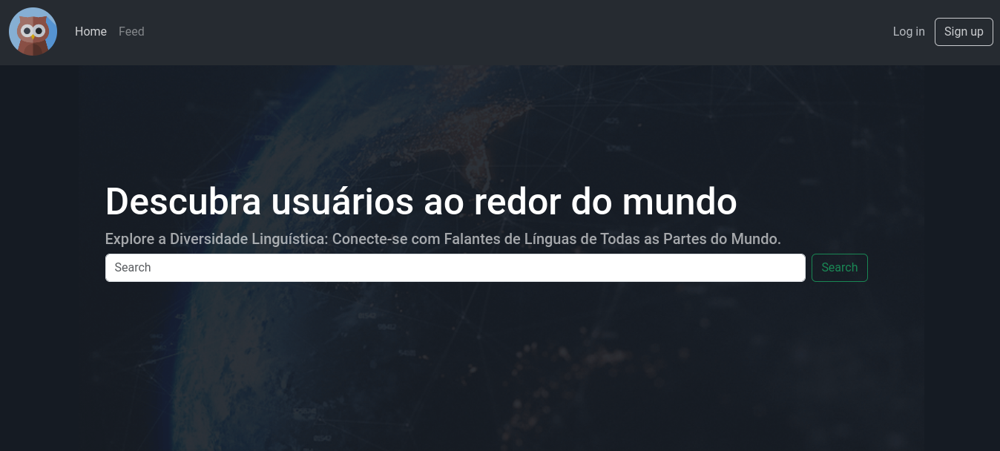

# MyLanguageLooksLike

[](https://opensource.org/licenses/MIT)

## Description

A platform where you can create a portfolio and showcase your language skills to the world.

## Table of Contents

- [Review](#review)
- [Installation](#installation)
- [Usage](#usage)
- [Contributing](#contributing)
- [License](#license)

## Review


## Installation

Step-by step
```bash
$ git clone https://github.com/ORobsonJr/mylanguagelookslike.git
```

```bash
$ cd mylanguagelookslike
```

```bash
$ pip3 install -r requirements.txt
```

## Usage

In the folder of the project.
```bash
$ python manage.py runserver
```

And after run the url bellow in your browser.
```
localhost:8000
```

## License

This project is licensed under the terms of the [MIT License](https://opensource.org/licenses/MIT). See the [LICENSE](LICENSE) file for details.

